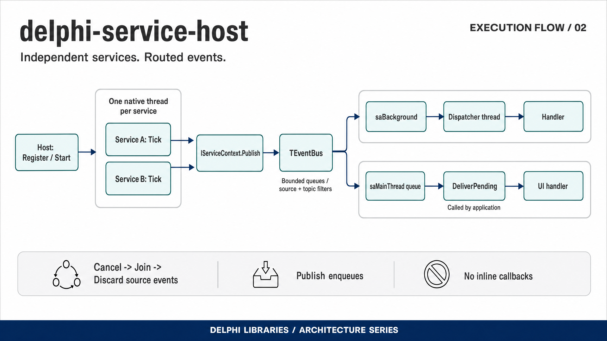

# delphi-service-host

Long-lived services that each own a thread and only ever talk to each other
through an event bus. Delphi and Free Pascal, no dependencies beyond the RTL and
[delphi-concurrent-pool](https://github.com/ramonruanxc/delphi-concurrent-pool),
which is vendored in [`lib/concurrent-pool`](lib/concurrent-pool/PROVENANCE.md).

## Quick start

```sh
git clone https://github.com/ramonruanxc/delphi-service-host
```

(or download the ZIP from GitHub — nothing else to fetch). No project options,
search paths, defines or package manager.

**Delphi XE7 or later:** open `demo/Newsroom.dpr` and press **F9**. The console
stays open until you press Enter when run under the debugger.

**Free Pascal 3.2.2**, from the repository root:

```sh
fpc demo/Newsroom.dpr
./demo/Newsroom        # demo\Newsroom.exe on Windows
```

It runs for about three seconds and ends with:

```
  events from the poller after Stop returned: 0
  ...
  published 21, delivered 34, dropped 0

Newsroom: OK
```

Exit code 0 on `Newsroom: OK`, 1 on `Newsroom: FAILED`. The event counts vary a
little from run to run; the `0` and the `OK` do not.

**Compiler status.** Free Pascal 3.2.2 is verified by CI on every push,
including the quick start command above exactly as written. Delphi XE7 and later
is the intended target and the code is written for it, but no Delphi build is
executed by CI or was executed for this layout — treat Delphi as unverified
until you have pressed F9 yourself.

```pascal
Host := TServiceHost.Create;

Host.Register(TPollerService.Create);          { publishes 'depth' }
Host.Register(Watchdog);                       { has never heard of TPoller }
Host.Bus.Subscribe(Watchdog.OnDepth, saBackground, 'poller', 'depth');

Host.StartAll;
...
Host.Stop('poller');   { cancel, join, discard — then it is gone }
```

Two services, two threads, no reference from either one to the other. The
wiring lives at the call site, where someone reading it can see the whole graph.

---

## Execution flow



Each service owns a native thread and publishes through an event bus.
Background subscribers run on the dispatcher; main-thread subscribers run when
the application calls DeliverPending.

## Why this exists

A background service is easy. Six of them, running at once, needing to react to
each other, is where it stops being easy — because the obvious solution is to
hand each service a reference to the others, and then the shutdown order starts
to matter, and then a callback runs on the wrong thread, and then a service that
you stopped is still heard from a moment later.

This is that problem solved once: services publish, subscribers subscribe, and
nothing in the middle knows both ends.

## What it guarantees

Each of these is a test, and each has a **negative build** — a compile-time
switch that removes the protection and makes CI fail. A guarantee nobody can
break on purpose is a guarantee nobody has checked.

| Guarantee | Removing it breaks |
|---|---|
| Publishing never blocks the publisher | `PROVE_SYNC_PUBLISH` |
| A subscriber runs on the thread it asked for | `PROVE_NO_AFFINITY` |
| After `Stop` returns, nothing of that service is left pending | `PROVE_NO_DISCARD` |
| A rejected registration is still owned by someone | `PROVE_CONST_REGISTER` |

The last one is the interesting one, and it is the reason the list is worth
having. It breaks no assertion — with the protection removed the suite still
passes, 59 of 59, and the process still exits 0. The only thing that changes is
that a service refused for having a duplicate name is never freed. Only the leak
gate sees it, so its CI step asserts the opposite of the other three: the run
must succeed *and* heaptrc must report unfreed memory.

## The four ideas

**A service does not know its audience.** `IServiceContext` gives a service its
name, a cancellation token, and a way to publish. It does not give it the host,
the bus, or any other service. What a service can do to the rest of the system
is bounded by that interface, not by discipline.

**The source is stamped, not passed.** `AContext.Info('depth', ...)` publishes
under the service's own name because the context fills it in. A service cannot
publish as another service, so a subscriber filtering on a source is filtering
on something the publisher could not forge.

**Delivery has a lane.** `saBackground` runs the handler on the dispatcher.
`saMainThread` runs it where VCL work is legal. The subscriber declares this
once, at `Subscribe`, and never has to think about it again.

**Stopping is three steps, in order.** Cancel the token, join the thread, then
discard that service's pending events from both lanes. Skipping the third leaves
a stopped service audible for another few milliseconds — which is exactly the
bug `PROVE_NO_DISCARD` reintroduces.

## Install

With [boss](https://github.com/HashLoad/boss):

```sh
boss install github.com/ramonruanxc/delphi-service-host
```

By hand: add `src/` and `lib/concurrent-pool/` to your search path. The pool is
a verbatim copy of an exact upstream commit, plus two small Delphi XE7 patches —
[`PROVENANCE.md`](lib/concurrent-pool/PROVENANCE.md) records which commit and
which patches — so what you build is what CI builds, not whatever that
project's main branch happens to be today.

## Writing a service

Descend from `TBaseService` and override `Tick`. The interval is how often the
host calls it; the rest has defaults.

```pascal
type
  TPollerService = class(TBaseService)
  protected
    procedure Tick(const AContext: IServiceContext); override;
  public
    constructor Create;
  end;

constructor TPollerService.Create;
begin
  inherited Create('poller', 120, 'reports a queue depth');
end;

procedure TPollerService.Tick(const AContext: IServiceContext);
begin
  AContext.Info('depth', 'queue depth sampled', MeasureDepth);
end;
```

`Starting` and `Stopped` run once each, on the service's own thread, either side
of the ticks — so neither needs a lock against them.

A tick that raises does not kill the service. The fault is counted, published as
an error event, and the next tick happens on schedule. `FaultCountOf` reports
the tally.

## Subscribing

```pascal
{ everything }
Bus.Subscribe(Archivist.Handle, saBackground);

{ one source }
Bus.Subscribe(Auditor.Handle, saBackground, 'poller');

{ one source, one topic }
Bus.Subscribe(Watchdog.OnDepth, saBackground, 'poller', 'depth');

{ anything that needs the VCL }
Bus.Subscribe(StatusBar.Update, saMainThread, 'poller', 'depth');
```

An empty filter means no filter. Subscribers are plain `of object` methods, so
anything can subscribe — a service, a form, or a bare object like the demo's
archivist.

`saBackground` needs nothing from you: the dispatcher thread delivers it.
`saMainThread` needs one line in your application, because the bus will not
invent a main thread to run on:

```pascal
procedure TMainForm.ApplicationIdle(Sender: TObject; var Done: Boolean);
begin
  Done := Host.Bus.DeliverPending = 0;
end;
```

`DeliverPending` delivers on the calling thread and returns how many it
delivered, capped so idle handling stays responsive under a burst.

## Carrying something bigger than an integer

`TServiceEvent` has a `Datum: Integer` for the common case and a
`Payload: IEventPayload` for everything else. The payload is an interface, and
that is the whole ownership story: three subscribers can each hold the same
payload, the publisher lets go immediately, and it is freed when the last one
does — by nobody in particular.

```pascal
type
  TScanResult = class(TInterfacedObject, IEventPayload)
  public
    Files: TArray<string>;
    function Describe: string;
  end;

AContext.Emit('scan-complete', TScanResult.Create, Length(Files));
```

The design this was extracted from handed the same raw `Pointer` to every
listener. Whoever freed it first left the others reading freed memory; if
nobody did, it leaked. There was no third option, only a convention.

## Running the demo

See [Quick start](#quick-start): open `demo/Newsroom.dpr` in Delphi and press
F9, or run `fpc demo/Newsroom.dpr` from the repository root.

Three services on three threads plus a non-service subscriber. Partway through,
the poller is stopped while it still has a backlog in flight, and the demo exits
non-zero if a single one of those events arrives afterwards.

```
  0.004s  host       all running
  0.265s  watchdog   depth 13 is above 12
  1.004s  watchdog   depth 11 is back under 12

  1.619s  host       stopping the poller mid-flight
  2.032s  host       events from the poller after Stop returned: 0

  what the archivist saw:
    poller     13 events
    watchdog   1 event
    ticker     7 events

  published 21, delivered 34, dropped 0

Newsroom: OK
```

`delivered` exceeds `published` because one event reaches several subscribers.
`dropped` is what a full lane discarded — publishing never blocks, so a bus that
cannot keep up drops and says so rather than stalling the service.

## Tests

```sh
mkdir -p build/normal
fpc -B -Mdelphi -Sa -Fusrc -Futests -Fulib/concurrent-pool \
  -FUbuild/normal -obuild/Tests tests/Tests.dpr
./build/Tests
```

59 assertions. `-Sa` matters: without it the pool's internal guards compile out
and part of the suite proves nothing. `-B` matters locally for the same reason:
the quick start leaves `.ppu` files built without `-Sa` next to the sources, and
without `-B` Free Pascal reuses them.

Every test is bounded, and a watchdog thread turns an overrun into a named
failure and exit 2 rather than a hung run:

```
WATCHDOG: test "waiting for the slow subscriber to catch up" exceeded 60 s
and is presumed deadlocked.
```

CI verifies the watchdog itself, with `--watchdog=0`. A safety net that has
never been dropped into is not known to hold.

## Two things worth knowing about Pascal

Both cost real time here, and neither is obvious from the documentation.

**A `const` interface parameter takes no reference.** `Register` is written to
be called with the service created inline — `Host.Register(TPoller.Create)` —
and declared `const`, a registration refused for a duplicate name would leave an
object that no reference ever counted. Nothing frees it. It is by value on
purpose, which is what `PROVE_CONST_REGISTER` restores.

**A managed temporary lives until its routine returns, not until its statement
ends.** Measured on FPC 3.2.2: a refcount read many statements after the
temporary was created, but still inside the same routine, counts it; the same
read after that routine returns does not. This is not a leak — but it will make
an ownership test in a single long routine report a number that is off by one,
and send you looking for a bug that is not there. The payload test's body is a
separate routine for exactly this reason.

## Where it came from

A service manager inside a personal project, with nineteen registered services
and a listener mechanism I wrote and ran for years. This is that idea, extracted
and rebuilt: the same shape, with the ownership question answered by refcounting
rather than by convention, and every claim under a test that can fail.

## Licence

MIT.
